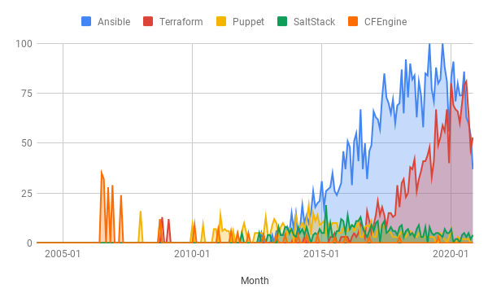
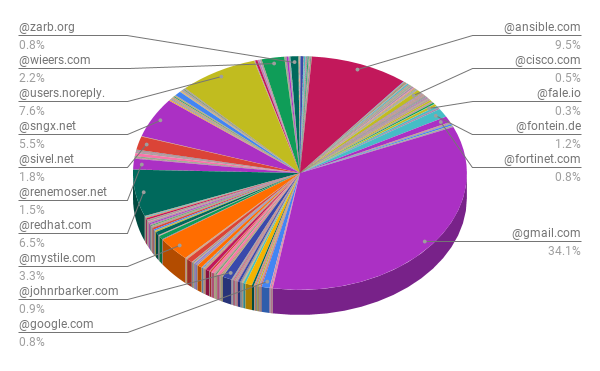
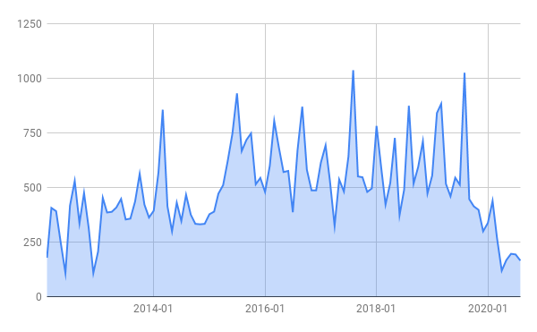
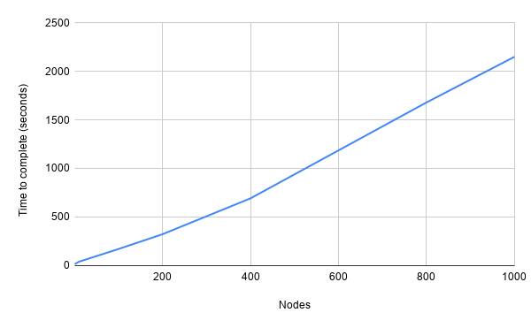

# Scope
The tools that have been selected have proven themselves in the IT industry and will likely continue to remain active for the next 5 years. The weights are scored from 1 to 5, where 1 is defined as least important and 5 as most important. These scores will be evaluated for all configuration management tools. All scoring must be properly motivated in order to provide an unbiased scoring. The scoring for these motivations are also scored from 1 to 5, where 1 is defined as insufficient and 5 as excellent.


## Configuration management tool property weights
| Number | Weight | Description                                                                                                             |
|--------|--------|-------------------------------------------------------------------------------------------------------------------------|
| 1      | 5      | Strong and active community |
| 2      | 4      | Maturity |
| 3      | 4      | Broad range of modules to simplify everyday tasks |
| 4      | 2      | Easily extensible in terms of functionality |
| 5      | 5      | Scalable performance |
| 6      | 4      | Scalable code components |
| 7      | 4      | Dynamic and readable templating abilities |
| 8      | 5      | Secure |
| 9      | 4      | Easy to use |
| 10     | 3      | Easy to learn |
| 11     | 5      | [DTAP](https://en.wikipedia.org/wiki/Development,_testing,_acceptance_and_production) like features/support |
| 12     | 4      | Central monitoring of failures + possible graphing abilities |


\pagebreak


## Properties defined
This section will briefly describe in more detail what the properties in Table 1 entail.

1) An strong and active community will assist in faster troubleshooting, newer features and bug fixes.

1) A mature configuration management tool is less likely to introduce complex upgrade paths, where e.g. rewrites of tasks are needed. Also bugs are less likely when a tool has matured into a more stable state over the years.

1) Every day tasks consist mainly out of managing files. Thus copy/sync/templating abilities shape the core. Other extra modules can range from managing system services e.g. SLURM, Apache and alike, managing software packages (installing/updating/removing), manage network settings (routes, IP, DNS) and query CMDBs.

1) Extensibility is the property to add functionality in the existing tool. E.g. the ability to create custom plugins that query a non-standard CMDB or custom template filters for recurring tasks on our cluster.

1) HPC consists out of many nodes, therefore, it becomes important that cluster-wide changes can be applied timely, regardless of its size. The time to complete a task such as applying a config file update on 1 node or 1000 should not diverge significantly.

1) General development rules are KISS (Keep It Simple Stupid) and DRY (Don't Repeat Yourself). Therefore, it would be ideal to have the ability to refer to existing code components rather than copy/pasting blocks of the same code (with possibly small alterations). Which in turn would make code maintenance more complex and error prone. This can also be referred to as code modularity.

1) Often configuration files are node-specific, therefore, agile but readable templating abilities are important. 

1) Configuration management tools allow full control over a cluster. Therefore, security is paramount. Sensitive information should be stored securely and actions of the configuration management tool should be authenticated. Furthermore, the security track record of a configuration management tool should be reviewed.

1) Configuration management tools are used to automate complex infrastructures. The complexity of an infrastructure should not be amplified by an (overly) complex solution to automate it.

1) Learning a new tool and use it well always takes time and experience. However, the easier it is to read and write tasks, the easier it is to troubleshoot errors and apply new changes.

1) DTAP (Development Testing Acceptance and Production) workflows require the ability to branch of from a stable state and experiment. Therefore, Git integration would be ideal to facilitate this. In which e.g. simply changing group membership of a node also changes which Git branch of the configuration management is executed. CI/CD pipelines should also be evaluated.

1) Keeping track of the desired state is the intention to prevent the so called "infrastructure drift" which is when the "live" deployment has drifted from its code representation. HPC clusters tend to be large, often consisting of 1000+ nodes. Keeping track of this desired state enforced by configuration management tooling therefore would be simplified by e.g. a monitoring dashboard.


# Method
The defined properties were tested per configuration management tool and we provided an objective weight to each of them. This was done unbiased. Therefore, the provided weight scores were based on data rather than opinion. When this was not possible, the technical abilities were outlined in a measurable way to defend the given score.

For example, a strong and active community can be measured by the amount of unique code commits per email address and domain, open and closed issues, forks and stars. However, not every commit has the same impact and size. It serves merely as an indication of community activity. Also the popularity can roughly be determined with [Google Trends](https://trends.google.com/) and compared with each other. Maturity is hard to measure besides age and persistent activity, open and closed issues and general development behavior. Templating abilities can be compared by e.g. how dynamic the tool allows creativity. However, the templating language/method should not be too complex to keep troubleshooting and development a low effort feat. The technical review is focused on HPC and the tooling used in this branch of IT. Outlining features outside of this context is done to provide a more informative overview. However, scoring the properties is done only for within the HPC domain.


\pagebreak


# Ansible results
## Community
### Testing method
GitHub was used to measure the community activity. The following commands were used to collect the data in the cloned repository of [Ansible](https://github.com/ansible/ansible). The CSV files were graphed by using Google Sheet graphs.

Total commits:
```sh
git --no-pager log | grep -E "^commit " | wc -l
```

Unique domains in CSV format:
```sh
git --no-pager log | grep Author | \
  grep -oE "\b@([A-Za-z0-9.-]+\.[A-Za-z]{2,6})\b" | \
  tr '[:upper:]' '[:lower:]' | sort | uniq -c | \
  sed 's/^\s*//' | tr ' ', ', ' > /tmp/"$(basename -- "$PWD")".csv
```

Commits per month in CSV format:
```sh
while read -r ignore1 ignore2 month day ignore3 year ignore4; do \
  date -d"$month $day $year" +%Y-%m; done < <(git --no-pager log | grep -E "^Date: ") | \
  sort | uniq -c | sed 's/^\s*//' | tr ' ', ', ' > /tmp/"$(basename -- "$PWD")".csv
```

Unique domains:
```sh
git --no-pager log | grep Author | grep -oE "\b@([A-Za-z0-9.-]+\.[A-Za-z]{2,6})\b" | \
  tr '[:upper:]' '[:lower:]' | sort | uniq | wc -l
```

Unique authors:
```sh
git --no-pager log | grep Author | \
  grep -oE "\b[A-Za-z0-9._%+-]+@[A-Za-z0-9.-]+\.[A-Za-z]{2,6}\b" | \
  tr '[:upper:]' '[:lower:]' | sort | uniq | wc -l
```

### Google Trends
Measuring popularity was done by using Google Trends (Figure 1), which is often used to predict or establish trends [@husnayain2020applications] [@choi2012predicting]. The results include web searches and were fine-tuned by filtering on enterprise technology in the computer and electronics category. Furthermore, worldwide results were taken into account from 2004 to the present day.

A clear popularity dominance was visible for Ansible, however, it has dropped significantly in 2020. This coincides with the global COVID-19 pandemic. Terraform also dropped in popularity in that same period, but less steep than Ansible. SaltStack and Puppet have more or less stabilized the past 3 years in popularity to an equal level, but are still in decline. CFEngine's popularity has halted in that same time period.

This trend correlates with a [survey article from TechRepublic](https://www.techrepublic.com/article/ansible-overtakes-chef-and-puppet-as-the-top-cloud-configuration-management-tool/) done in 2019, showing that Ansible had the most widespread usage across survey respondents, at 41%, followed by Chef and Puppet in a tie at 31%, with Terraform at 31%, and SaltStack at 18%. The TechRepublic article stated that 786 respondents were surveyed, 58% of which work in enterprises of over 1000 employees. Furthermore, Red Hat has collected a few [success stories](https://www.ansible.com/resources/case-studies) and [use-cases](https://www.ansible.com/use-cases) of Ansible ranging from BMW, Microsoft, NetApp, Arista, Atlassian, Amazon, VMware, Cisco, Google and NASA.

{width=425px}


### Community activity and strength
The Ansible community is large and active with contributions from individuals and notable corporations (Red Hat, Cisco and Fortinet) as can be seen in Figure 2. The commits per month have slowed down significantly (Figure 3), it is likely that this is due to the COVID-19 pandemic outbreak of early 2020. Furthermore, Ansible has a community platform called [Ansible Galaxy](https://galaxy.ansible.com/), which is used to share a large repository of configuration management code. As an indication, there are over 100.000 playbooks available. Of which over 20.000 are for RHEL, over 40.000 for Debian, over 30.000 for Fedora, and over 100.000 for Ubuntu. These also include HPC playbooks, such as for [SLURM](https://github.com/CSCfi/ansible-role-slurm). These playbooks can be downloaded and executed with the `ansible-galaxy` client command as well, which is part of the Ansible project. Based on that, it was scored with a 5.

* Commit snapshot: 159544610e5a925d589198febaa5198778ea51c0 (Tue Sep 1 19:25:08 2020 +0530)
* Branch: devel
* Total commits: 50.632
* Unique contributers: 6119
* Unique domains: 2394
* Open issues: 1546
* Closed issues: 26.417
* Stars: 44.600
* Forks: 19.500

{width=425px}

{width=425px}


## Maturity
Ansible is active since February 2012. According to critical reviews from e.g. UpGuard which reviewed [Ansible vs. Chef](https://www.upguard.com/blog/ansible-vs-chef#infographic) and [Ansible vs. Puppet](https://www.upguard.com/blog/ansible-puppet), the project is promising, but still maturing when compared to these older alternatives. Furthermore, Ansible includes a [plethora of community modules](https://docs.ansible.com/ansible/latest/modules/community_maintained.html), which are maintained by the community and thus its quality may vary. Major release cycles occur about every 6 months, but one release may be skipped. Each release comes with a [list of deprecated and/or removed features](https://github.com/ansible/ansible/blob/stable-2.9/changelogs/CHANGELOG-v2.9.rst#id42) and instructions to solve these upgrade issues. In relative terms, the amount of features removed/deprecated per release are small. Beside these issues, upgrading Ansible is relatively simple since the dependencies are essentially Python and SSH. However, since releases are short and may require rewriting tasks, it was scored with a 4.

* Ansible 2.10, in development, currently in beta
* Ansible 2.9, currently maintained in terms of security and general bug fixes, released in 2019-10-31
* Ansible 2.8, currently maintained in terms of security fixes, released in 2019-05-16
* Ansible 2.7 and older, end-of-life


## Modules
Ansible comes with "batteries included", that means no actions are required to enable or include modules.

* Cloud modules
* Clustering modules
* Commands modules
* Crypto modules
* Database modules
* Files modules
* Identity modules
* Inventory modules
* Messaging modules
* Monitoring modules
* Net Tools modules
* Network modules
* Notification modules
* Packaging modules
* Remote Management modules
* Source Control modules
* Storage modules
* System modules
* Utilities modules
* Web Infrastructure modules
* Windows modules

When Ansible is installed, all modules that passed the release tests are included. As of writing, these are [3387 modules](https://docs.ansible.com/ansible/2.9/modules/list_of_all_modules.html). These modules offer a broad range of features for e.g. SUSE Linux Enterprise, Red Hat Enterprise Linux, Debian, CentOS, macOS, BSD, Ubuntu and Windows.

Ansible can deploy to bare metal hosts, virtualized systems and cloud environments, including Amazon Web Services, Atomic, CenturyLink, Cloudscale, CloudStack, DigitalOcean, Dimension Data, Docker, Google Cloud Platform, KVM, Linode, LXC, LXD, Microsoft Azure, OpenStack, Oracle Cloud, OVH, oVirt, Packet, Profitbricks, PubNub, Rackspace, Scaleway, SmartOS, SoftLayer, Univention, VMware, Webfaction, and XenServer.

Furthermore, Ansible supports network operating systems such as Arista EOS, Cisco IOS, IOS-XE, IOS-XR, NX-OS, Juniper Junos OS and VyOS.

Although this list is impressive, for an HPC cluster which runs e.g. bare metal hosts on Red Hat and Debian, most of these features are uninteresting. However, it is worth noting the support for KVM and OpenStack, it is possible that future supercomputer vendors will integrate these solutions.

Furthermore, Ansible includes [all the basics](https://opensource.com/article/19/9/must-know-ansible-modules) to manage a GNU/Linux operating system, and more. Therefore, the was scored with a 5.


## Extensibility
Ansible provides comprehensive documentation and examples to create custom [modules](https://docs.ansible.com/ansible/latest/dev_guide/developing_modules_general.html). But also a [range of other custom plugins](https://docs.ansible.com/ansible/latest/dev_guide/developing_plugins.html).

* Action plugins, let you integrate local processing and local data with module functionality
* Cache plugins, store gathered facts and data retrieved by inventory plugins
* Callback plugins, add new behaviors to Ansible when responding to events
* Connection plugins, allow Ansible to connect to the target hosts so it can execute tasks on them
* Filter plugins, allow Ansible to manipulate data and can e.g. be used in templates
* Inventory plugins, parse inventory sources and form an in-memory representation of the inventory
* Lookup plugins, pull in data from external data stores
* Test plugins, allow Ansible to verify data and can e.g. be used in templates
* Vars plugins, inject additional variable data into Ansible runs that did not come from an inventory source, playbook, or command line

Due to this comprehensive list of customization with documented examples, which are relatively easy to write and read since it is in Python, it was scored with a 5.


## Scalable performance
Ansible has 2 modes of operation; push and pull. Its default and simplest setup is the push model. This works similar to Synctool, which is in use for the Cartesius supercomputer. SSH connections are used for each task. This method of applying changes is relatively slow and does not scale for large systems. However, some tweaks allow [performance boosts](https://www.toptechskills.com/ansible-tutorials-courses/speed-up-ansible-playbooks-pipelining-mitogen/), such as changes in SSH, experimenting with [Ansible strategies](https://docs.ansible.com/ansible/latest/user_guide/playbooks_strategies.html) and e.g. customizing the node batch sizes.

Due to this scaling limitation Ansible also has a [pull based method](https://docs.ansible.com/ansible/latest/cli/ansible-pull.html) for "extreme scale". Which mimics to a certain extent the agents of other configuration management tools. Ansible runs can be initiated with a cron job, systemd timer and/or epilog in case of a SLURM node. The `ansible-pull` command pulls in the configuration management code from e.g. Git and then executes it, a specific branch such as "development" and "production" can also be provided. In order to keep check of these decentral Ansible runs, [callback plugins](https://docs.ansible.com/ansible/latest/plugins/callback.html#plugin-list) can be used to send output data to e.g. Logstash or Grafana. These callback plugins can also send the data in raw JSON, to be processed by a custom translator. Or a custom callback plugin can be written to integrate with existing monitoring.

The (custom tuned) performance of the push mode is evaluated in the next subsection and is scored with a 1 in respect to the size of HPC clusters. However, the pull model offers better performance and flexibility, and is therefore scored with a 4. It was not scored with a 5 due to the lack of intelligence of an agent-based solution. Although configuration management agents in an HPC cluster may also not be ideal due to the CPU jitter it may cause during compute jobs. But this depends on how an HPC site takes CPU jitter with respect to the benefits of an agent-based solution.


### Benchmarks
Synctool is used for many years on the Cartesius cluster with an overall positive performance experience. Therefore, as a known performance reference point, the same management node was used for Ansible benchmark. This management node is a VM with 4 cores and 8 GB RAM, running on a Intel(R) Xeon(R) CPU E5-2650 v3 @ 2.30GHz (Bull R423-E4m). This management node SSH jumps to another node in the cluster in order to apply changes.

Since the push model of Ansible is questionable in term of performance, a generic use case was created to scale out on 1000 nodes. This test was performed on a live HPC cluster with running jobs, performance per node may therefore differ. Furthermore, due to the live cluster, no major changes could be applied such as restarting services or install/remove software. Since the bulk of configuration management on GNU/Linux systems are based on files, the following tests were created. 1) 10 plain text file transfers with the copy module, 2) 5 files with the template module. Of the templates, multiple variations were generated and applied. These were 2 template files involving [tuned](https://tuned-project.org/) profiles of which the directory structure was created by Ansible beforehand. A template for an MOTD and an issue.net file. An RPM macro file for 2 users. And generating 4 different Apache configuration files. In effect this totals to 10 template generated files and 10 plain text files. These tasks and templates include loops and conditionals as well as variable lookups. At the end of the [benchmark playbook](https://github.com/AquaL1te/ansible-in-hpc/tree/main/ansible), all the files were deleted again. This benchmark playbook was run on 1, 10, 100, 200, 400, 800, 1000 nodes and the completion time was recorded with the `profile_roles` callback plugin.

The following best-effort optimizations were applied for the push model. Before Ansible runs, it by default gathers so called facts, which are node specific variables such as operating system, CPU, memory, network and disk information. This information can be used in e.g. templates or in conditional statements. Gathering these facts takes time, and does not need to be done multiple times a day. Therefore, fact caching was enabled by using Redis, with a TTL of one day. Without this improvement, the gathering of facts alone take up 8 minutes for 1000 nodes.

Furthermore, Ansible depends on SSH. The `ControlMaster=auto` and `ControlPersist=600s` SSH options were used which improve latency performance by keeping persistent connections open. Pipelining was enabled, which reduces the number of SSH operations required to execute a module on the remote server, by executing many Ansible modules without actual file transfer.

The number of forks was set to 25, this is the number of parallel processes to spawn when communicating with remote hosts. The amount of nodes per batch can also be configured in a list of values, i.e. in the case of this benchmark; 200, 400, 50%. These sizes are picked in order and when more than 400 nodes are in a node set, 50% of the set is then done per batch. These values were chosen based on initial performance observations, mainly to manage the CPU usage of the Ansible node that pushes the changes. Fine-tuning of these parameters can be a research of its own, which is not the goal of this research. There are more performance features that can be explored, but the following should suffice for a baseline result to conclude the performance of Ansible. One of those is the [Mitogen strategy plugin](https://github.com/ansible/ansible/issues/45839). However, this strategy plugin is not part of the main Ansible code due to removing some functionality and breaking backwards compatibility with older Ansible versions. It was therefore not tested on Cartesius, performance gains of up to 35% were recorded.

{width=425px}

As seen in Figure 4, the performance scales linear, not exponential. Which is expected since the push model is a one to many communication model. The total time to apply changes to 1000 nodes took ~30 minutes. Due to the larger node set of 1000, it was clear from the output that this longer delay was due to only a few nodes in the batch. In order to better filter out these outliers, it would have been best to do these tests once every day for 10 days and visualize these results in boxplots. However, this would disrupt the live cluster too much and therefore, every test was done only once. In comparison, Synctool takes ~10 minutes to complete a dry-run on ~2000 nodes, Ansible in dry-run mode takes ~20 minutes to complete its limited benchmark test on 1000 nodes.

However, the Ansible pull model would perform the changes locally and thus the performance would be equivalent to the completion time of one node (~15 seconds). Given no other bottlenecks are present, such as the Git repositories to pull in the most recent changes before Ansible runs. Ansible push seems to run reasonable for ~100 nodes. It is therefore recommended to use the pull model for Ansible in large clusters such as Cartesius. The Ansible pull may e.g. be started at the end of a compute job via the epilog scripts of SLURM, eliminating the otherwise extra CPU jitter.

There are also a few community and commercial solutions available to execute and distribute Ansible runs. Since these tools also provide monitoring abilities, they are described in more detail in the monitoring section.


## Scalable code
Ansible is structured in a hierarchy of nodes and groups of nodes. These nodes or groups of nodes are assigned to roles. A role is a collection of tasks. This hierarchy is called a Playbook, but is not limited to this top-down structure. Ansible can conditionally [include/import](https://docs.ansible.com/ansible/latest/modules/include_module.html#see-also) playbooks, roles and tasks during run-time. Additionally, [Ansible Galaxy](https://galaxy.ansible.com/) can be used to include community playbooks. This allows Ansible to keep certain tasks centrally without duplicating it with small alternations, which complicates development and troubleshooting. Therefore, it was scored with a 5.


## Templating
Ansible uses the [Jinja2](https://jinja.palletsprojects.com/) templating language to create simple, fast, and designer-friendly templates. These templates can be very dynamic when taking into account the [Ansible inventory](https://docs.ansible.com/ansible/latest/user_guide/intro_inventory.html), such as [Facts](https://docs.ansible.com/ansible/latest/user_guide/playbooks_variables.html#variables-discovered-from-systems-facts).

The following template snippet is using the hardware information gathered by Ansible to configure certain elevator settings for the local disks on a node. This allows flexible and maintenance friendly tuning of nodes.
```yaml


[disk_{{ item.key }}]
type=disk
devices={{ item.key }}

elevator=none

elevator=mq-deadline

elevator=noop

```

The following snippet creates DNS records for all hosts from 2 inventory groups. Filters are used to filter out IPv6 addresses and format those address in the appropriate format. The Jinja2 `format` filter allows to create structured columns for the DNS records. Other [Ansible filters](https://docs.ansible.com/ansible/latest/user_guide/playbooks_filters.html) can also be used to e.g. create reverse DNS records or determine the first or last usable IP in a subnet.
```yaml


{{ '{:32}{:8}{}'.format(node, 'AAAA', lookup('neo', hostvars[node].network, 'native', 'ip') | \
  ipv6('address') | first) }}

```

Ansible and Jinja2 filters together with the Jinja2 templating language and the Ansible inventory allow advanced templating, therefore it was scored with a 5.


## Security
Ansible has had a relative clean security record, up until 2018. In Figure 5 the total percentages of CVEs related to Ansible are visualized. There were 22, 19 and 37 CVEs released in the respective years of 2018, 2019 and 2020. Since its inception in 2012 it has seen a total of [89 CVEs released](https://nvd.nist.gov/vuln/search/results?form_type=Basic&results_type=overview&query=ansible&search_type=all).

{width=425px}

Furthermore, due to the agent-less configuration and the small dependency chain of mainly Python and SSH, the attack surface is smaller than other configuration management tools. A securely configured SSH daemon (which is already a must) and a secure user which Ansible can use to run tasks already provides a sufficient secure baseline.

Ansible also supports [encrypted vaults](https://docs.ansible.com/ansible/latest/user_guide/vault.html) to store sensitive variables such as passwords or cryptographic information. In addition, Ansible provides filters to generate secure password hashes which can be used in e.g. `/etc/shadow`. The following example takes in a plain text password from an encrypted vault, then hashes it with SHA256 with 65536 iterations. Furthermore, it uses the hostname as a salt value. This makes cluster-wide rainbow attacks unfeasible because password hashes are unique per host, even when using the same password.

```yaml
password: "{{ vault_system_user.root | password_hash('sha512', 65536 | \
  random(seed=inventory_hostname) | string) }}"
```

However, due to the trend of increased CVE reports, it was scored with a 2.


## Easy to use
As mentioned, Ansible has 2 modes of operation; push and pull. The push model is [easy to setup](https://docs.ansible.com/ansible/latest/user_guide/intro_getting_started.html). The core dependencies are Python and SSH and management can be done from a single host (downside of this mode is relative slow performance, as mentioned earlier in the performance section in more detail). Ansible provides a structured hierarchy to organize an infrastructure. This guided structure makes it relatively easy to break up a complex infrastructure into small pieces of reusable code. As an example, a [SLURM role](https://github.com/indigo-dc/ansible-role-slurm). The tasks directory consists out of the executive part of the role. The template directory contains Jinja2 templates. The handler directory contains any actions that should be done when the playbook finishes, such as restarting services. The defaults directory contains default variables which can be overruled with a directory called vars.

The pull mode requires more dependencies. It requires a VCS (Version Control System) such as Git or Subversion. However, these are often already part of such a setup for code version management. Furthermore, as mentioned in more detail in the performance section, it would be prudent to have central monitoring for such a setup. This adds more dependencies and increases the complexity.

Furthermore, the Ansible code is written in Python which makes adding new functionality relatively easy, as explained in the extensibility section. Code can also be reused by importing/including conditionally during run-time, as explained in the scalable code section. And to conclude, [Ansible Galaxy](https://galaxy.ansible.com/) provides a plethora of ready-to-use examples. As mentioned in the performance section, the performance of the push model needs to be evaluated before we can make final conclusions on which mode of operation should be used. But due to this uncertainty, easy to use is scored with a 3. If the push model provides adequate performance it would be scored with a 5.


## Easy to learn
Ansible tasks are written in [YAML](https://docs.ansible.com/ansible/latest/reference_appendices/YAMLSyntax.html), which makes data type creation, loops and value lookups simple. It is a human-readable syntax. Ansible provides well written [documentation](https://docs.ansible.com/ansible/latest/modules/copy_module.html) for every module and with many practical examples. Templates are written in  Jinja2, which is explained in more detail in the templating section. Once the [Ansible directory structure](https://docs.ansible.com/ansible/latest/user_guide/playbooks_best_practices.html#content-organization) is understood, building playbooks is relatively straightforward from there. Due to this easy learning-curve it was scored with a 5.


## DTAP
As mentioned in the performance section, when using `ansible-pull`, a specific Git branch can be provided for Ansible to use. This can be a "development" or "production" branch. The Ansible pull script on the node could e.g. pull this branch value from a DNS TXT record for its own hostname.

Furthermore, Ansible comes with extensive testing tools to integrate with e.g. Git hooks to provide a CI/CD pipeline. A notable solution is [Ansible Molecule](https://molecule.readthedocs.io/en/latest/), which uses Docker/Podman to test playbooks. This is a low weight testing infrastructure which can easily be teared down and up again, even on a laptop. It allows to test the playbooks for errors and idempotency. Therefore, it was scored with a 5.


## Central monitoring
Ansible has the ability to provide central monitoring by the use of callback plugins for e.g. Logstash or Grafana, or raw JSON. In the performance section it is mentioned in more detail. Ansible also provides a commercial solution which includes monitoring features, this is a product from Red Hat called [Ansible Tower](https://www.ansible.com/products/tower). The upstream project of Ansible Tower is the non-commercial [Ansible AWX](https://github.com/ansible/awx). Setting this up could be done with official containers from Ansible. The setup needs to be tested. Ansible AWX may provide a non-commercial solution to have central control and monitoring capabilities over the cluster. A potential alternative to AWX could be [ARA](https://github.com/ansible-community/ara), which uses REST API messages to store the data in a central database of which the content can be visualized in a web dashboard. Another alternative would be to use the [Logstash callback plugin](https://docs.ansible.com/ansible/latest/collections/community/general/logstash_callback.html) in order to process and visualize the data in a Kibana or Graylog dashboard. Which can be integrated into the Grafana dashboard as a back-end. It was therefore scored with a 3 because Ansible AWX, ARA and/or the Logstash solutions need to be tested, if this works as advertised, then it may be scored with a 5, depending on the complexity of these solutions. As a side note, [Rundeck](https://www.rundeck.com/open-source) may also be used to execute distributed Ansible runs and provide central monitoring by combining it with the Logstash plugin.


## Summary
Ansible is a very active, mature and popular project. Which offers a broad range of modules to get any HPC task done. However, in recent years the number of CVEs has grown. This may coincide with the popularity and broad range of modules and functionality available, which broadens the attack surface and scrutiny. Ansible also facilitates a CI tool called Molecule which allows testing of the playbooks inside containers. Which improves quality control. Furthermore, Ansible tasks are written in Yaml which is human-readable. Custom additions can be made to Ansible by using Python, which is also an easy to read and write language. The templating language that is used in Ansible is Jinja2, which is again an easy to read and write language and is feature rich. In relative terms, Ansible has a good security track record. Furthermore, Ansible has tight integration with e.g. Git, where specific branches can be used when the push or pull model is used. Where Ansible lacks is in terms of performance when the push model is used. However, the pull model alleviates this disability. Also, AWX, which is the community version of Ansible Tower may also need to be tested. AWX provides monitoring and scheduling of Ansible runs. Furthermore, there are numerous solutions to monitor `ansible-pull` runs e.g. with Logstash, AWX or ARA.


| Number | Weight | Score | Effective score | Description                                                  |
|--------|--------|-------|-----------------|--------------------------------------------------------------|
| 1      | 5      | 5     |                 | Strong and active community                                  |
| 2      | 4      | 4     |                 | Maturity                                                     |
| 3      | 4      | 5     |                 | Broad range of modules to simplify everyday tasks            |
| 4      | 2      | 5     |                 | Easily extensible in terms of functionality                  |
| 5      | 5      | 4     |                 | Scalable performance                                         |
| 6      | 4      | 5     |                 | Scalable code components                                     |
| 7      | 4      | 5     |                 | Dynamic and readable templating abilities                    |
| 8      | 5      | 2     |                 | Secure                                                       |
| 9      | 4      | 5     |                 | Easy to use                                                  |
| 10     | 3      | 5     |                 | Easy to learn                                                |
| 11     | 5      | 5     |                 | DTAP like features/support                                   |
| 12     | 4      | 3/5   |                 | Central monitoring of failures + possible graphing abilities |
